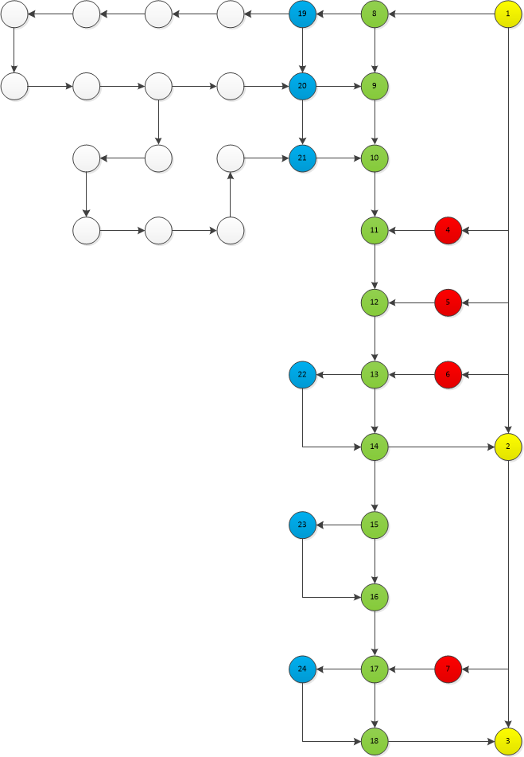

# Guide for Developers

We're very glad that you're interested in improving this project. You may have a look at the following information as reference:

## Git Specifications

### Our Workflow

A simplified version of GitFlow (Driessen, 2010) is being used in this project.

### Branching Model

1. **master** (trunk) branch (marked in yellow) is the branch for stable release. All codes are well-tested, well-documented, ready for production environment and bug-free. In this graph, there are 3 commits labelled 1, 2 and 3, representing 3 different releases. Merge commit from **develop** branch only, with no rebasing and no force-push.
2. **develop** (marked in green) is the main developing branch which accept merging commits from different features. Again, merge commit from **feature/\*** branch only with no rebasing and no force-push.
3. **feature/\*** (marked in blue) are the branch where actual development is taking place. When you're about to perform rebasing and/or force-push, please get permission from others on this branch. It should be merged into **develop** branch and released together with new features.
4. **hotfix** (marked in red) are branches where problems from a previous release is being fixed. It should also be merged into **develop** branch and released together with new features.

### Other Rules

1. 代码千万行，注释第一行；注释不规范，同事两行泪。
2. Inform others before updating software.

## References

Driessen, V. (2010), A successful Git branching model, available from <https://nvie.com/posts/a-successful-git-branching-model/>.